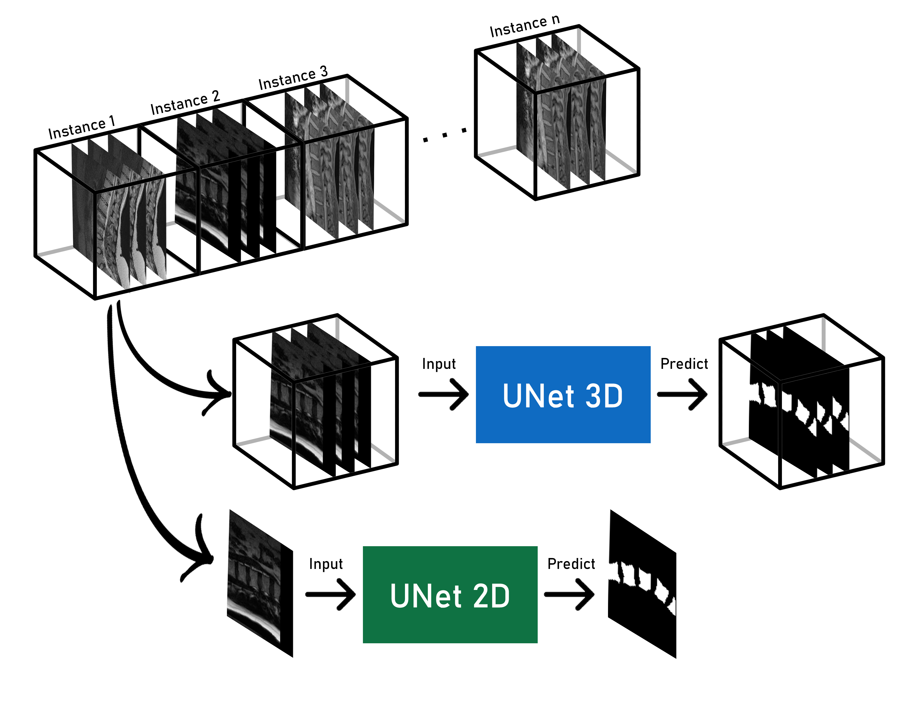
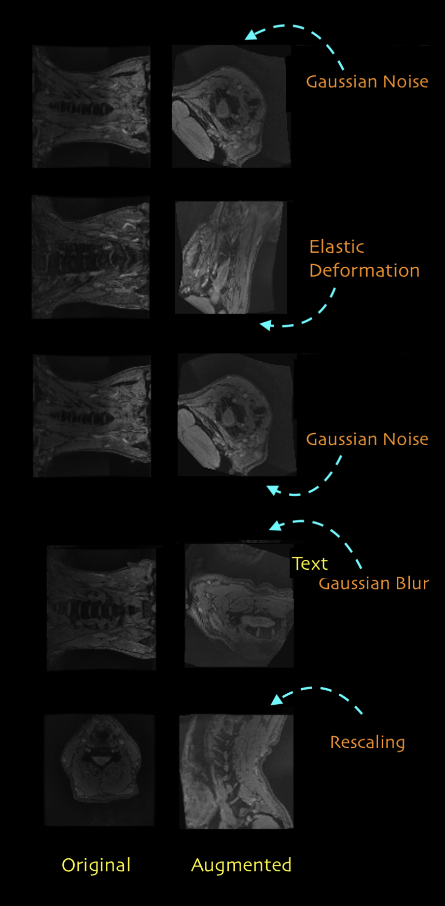
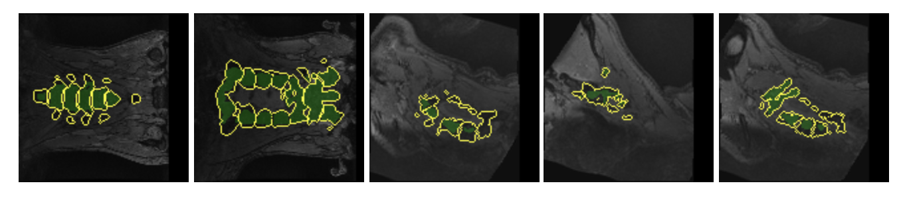
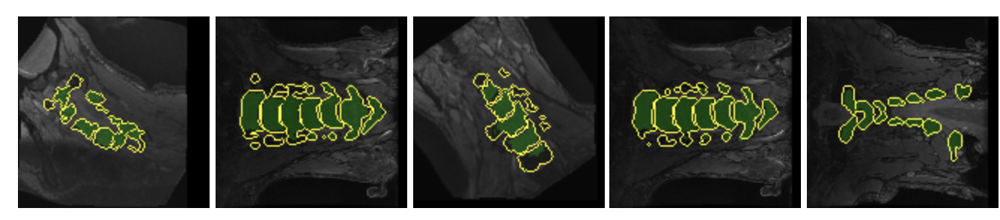
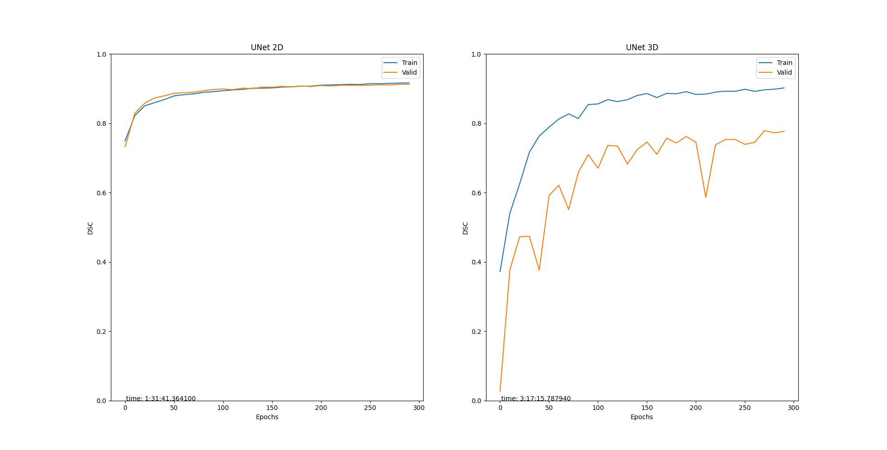

# Segmentation of thoracic and lumbarspine using deep learning

This research is about segmentation for throatic and lumbar spine using deep learning techniques. Convolutional neural network has been employed. Furthermore, there has been UNet-2D and Unet-3D applied as its type of architecture.  
As per the augmentation techniques, gaussian, rescaling, blur, rotation applied to improve the generalization aspect of the model and also diceCoeficient and diceLoss for the evaluation metrics.

Training with this data might take up to few days to finish depending on the batch size and hardware limitations. In a Meanwhile the validation error between Unet-2D and Unet-3D has been compared.

Unet 3d is just another version of unet2d where it uses 3D filters in its computation of convolution. 
All trained models will be validated on a never seen data called the test data and later will be compared with each other.

#### Work flow :
Here you can see the model architecture for both 2d and 3d. 
Depending on the model architecture, UNet 3d or UNet 2d, the input data must be designed accordingly. 

#### Sample augmented images :

#### Unet-2D output result:

#### Unet-3D output result:

## what you need 

The necessary packages that needs to be installed can be found in `requirement.txt` file.

- numpy
- future
- gast
- tensorflow
- tensorflow-addons
- pynrrd
- pickle-mixin
- scipy
- h5py
- pillow
- volumentations-3D
- keras
- pydot

## How to use
1. Create a text file containing the list of nrrd image files and their segmentation seperated by comma and line. As an example:  
	 `(path-to-first-nrrd-image-file),(path-to-first-nrrd-label-file)`  
	 `(path-to-second-nrrd-image-file),(path-to-second-nrrd-label-file)`  
		.
		.
		.
		 
2. Use the adreess to the text file and launch `makeCube.py` to create a 3D matrix that contains all the images together with their augmented versions. 
3. Use `checkCube.py` to observe and make sure that the matrix is created correctly.  
4. Use `train.py` to train the model and predict the labels. 

### Datasets

The data is taken from different sources:

#### zenodo: https://zenodo.org/record/22304#.X1TMg9Mza3L  
#### Uni-siegen: https://onlinelibrary.wiley.com/doi/abs/10.1111/cgf.12343   
#### Osf: https://osf.io/hns8b/?view\_only=f5089274d4a449cda2fef1d2df0ecc56   
#### vissim-datasets(Cervical spine, Whole spine): https://www.uni-koblenz-landau.de/en/campus-koblenz/fb4/icv/vissim

### Evaluation results

The result for the comparison of Unet-2D and Unet-3D is presented in Table below. The result explains the validation and test estimates for these two models, where Unet-2D has the higher accuracy in validation, while on the other hand Unet-3D performs better in the test data sets. 

<table class="tg">
<thead>
  <tr>
    <th class="tg-v0hj" rowspan="2"> Datasets</th>
    <th class="tg-v0hj" colspan="2">Valid</th>
    <th class="tg-v0hj" colspan="2">Test</th>
  </tr>
  <tr>
    <td class="tg-dvid">Unet-2D</td>
    <td class="tg-dvid">Unet-3D</td>
    <td class="tg-dvid">Unet-2D</td>
    <td class="tg-dvid">Unet-3D</td>
  </tr>
</thead>
<tbody>
  <tr>
    <td class="tg-0pky">Cervical spine</td>
    <td class="tg-fymr">0.8921</td>
    <td class="tg-0pky">0.6451</td>
    <td class="tg-0pky">0.6729</td>
    <td class="tg-0pky">0.7488</td>
  </tr>
  <tr>
    <td class="tg-0pky">Siegen and Cervical spine</td>
    <td class="tg-fymr">0.8943</td>
    <td class="tg-0pky">0.5950</td>
    <td class="tg-0pky">0.6403</td>
    <td class="tg-0pky">0.6813</td>
  </tr>
  <tr>
    <td class="tg-0pky">Zenodo,Siegen,Cervical spine</td>
    <td class="tg-fymr">0.9125</td>
    <td class="tg-0pky">0.7769</td>
    <td class="tg-0pky">0.7762</td>
    <td class="tg-0pky">0.8063</td>
  </tr>
  <tr>
    <td class="tg-0pky">Osf,Siegen,Cervical spine</td>
    <td class="tg-fymr">0.8947</td>
    <td class="tg-0pky">0.7022</td>
    <td class="tg-0pky">0.541</td>
    <td class="tg-0pky">0.667</td>
  </tr>
  <tr>
    <td class="tg-0pky">Zenodo,Whole spine</td>
    <td class="tg-fymr">0.9101</td>
    <td class="tg-0pky">0.7675</td>
    <td class="tg-0pky">0.7503</td>
    <td class="tg-0pky">0.7973</td>
  </tr>
  <tr>
    <td class="tg-0pky">Zenodo,Siegen,Whole spine,Osf</td>
    <td class="tg-fymr">0.8986</td>
    <td class="tg-0pky">0.7101</td>
    <td class="tg-0pky">0.6755</td>
    <td class="tg-0pky">0.7659</td>
  </tr>
  <tr>
    <td class="tg-0pky">Zenodo, Siegen, Whole spine,Cervical spine, Osf (tripled augmentation)</td>
    <td class="tg-fymr">0.885</td>
    <td class="tg-0pky">0.7586</td>
    <td class="tg-0pky">0.668</td>
    <td class="tg-0pky">0.748</td>
  </tr>
</tbody>
</table>

Training accuracy over epochs for Unet-2D and Unet-3D of one of the combination datasets has shown in follow. 

